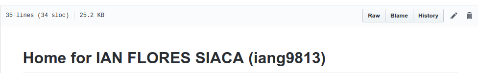

# MDS GitHub Course Downloader

## Overview

There are many courses in the Master of Data Science at UBC, downloading ALL of the materials for each course can become tedious at the end of term. I made an R script that downloads all the Github UBC repositories for students in MDS, removes the git information, and saves them in the courses folder that is created. Why do we need to remove the git information? It is the easiest way to be able to then upload the `courses` directory as a Github.com repository. 

## Execution 

There are two steps to be able to run this code: 

- Get the home URL

Go to the `README.md` file in your home repository in `github.ubc.ca`. Press the raw button in the top right corner. 



Your home URL is going to be the URL that you obtain by pressing this button. 

- Get and execute the code

```
git clone <repo_name>
```

```
cd <repo_name>
```

```
Rscript get_courses <your_home_url>
```
## Notes

This script has only been tested for UNIX systems using SSH login for `github.ubc.ca`. At the moment, I can't expand it to Windows as I don't have access to a Windows system. If you want to configure SSH you can follow this explanation offered by Dr Jenny Bryan. [Happy Git with R | SSH Keys](http://happygitwithr.com/ssh-keys.html)

## Dependencies

```
R version 3.5.1 (2018-07-02)
Platform: x86_64-pc-linux-gnu (64-bit)
Running under: Ubuntu 18.04.1 LTS

Attached packages:
 - tidyverse_1.2.1
```